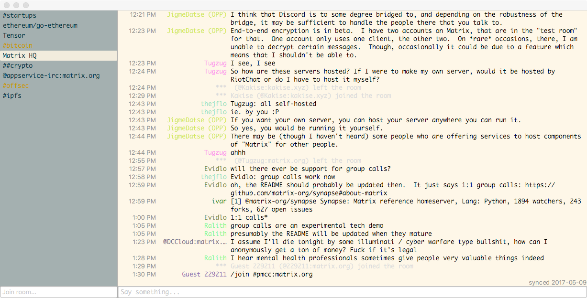

# Tensor
Tensor is an IM client for the [Matrix](https://matrix.org) protocol in development. [](https://travis-ci.org/davidar/tensor)


## Pre-requisites
- a Linux or Windows system (MacOS should work too)
- a Git client (to check out this repo)
- a C++ toolchain that can deal with Qt (see a link for your platform at http://doc.qt.io/qt-5/gettingstarted.html#platform-requirements)
- CMake (from your package management system or https://cmake.org/download/)
- Qt 5 (either Open Source or Commercial)
- KDE Framework Core Addons (optional; a submodule from KDE git is included in this repo and will be used if CMake doesn't find a KCoreAddons package)

## Linux


### Installing pre-requisites
Just install things from "Pre-requisites" using your preferred package manager. If your Qt package base is fine-grained you might want to take a look at CMakeLists.txt to figure out which specific libraries Tensor uses.

### Building
From the root directory of the project sources, first update submodules:

```
git submodule update --init # pull in qmatrixclient library
```

Then open the project in QtCreator and build.

### Installation
From the root directory of the project sources:
```
cd build
sudo make install
```

## Android

[](https://f-droid.org/repository/browse/?fdid=io.davidar.tensor)

Alternatively, [Download *Qt for Android*](http://www.qt.io/download-open-source/#section-2), open `tensor.pro` in Qt Creator, and [build for Android](http://doc.qt.io/qt-5/androidgs.html).


## OS X




## iOS


- [Qt for iOS](http://doc.qt.io/qt-5/ios-support.html)
- [Qt5 Tutorial: Bypass Qt Creator and use XCode](https://www.youtube.com/watch?v=EAdAvMc1MCI)

## Windows


### Installing pre-requisites
Here you have options.

#### Use official pre-built packages
Notes:
- This is quicker but takes a bit of your time to gather and install everything.
- Unless you already have Visual Studio installed, it's quicker and easier to rely on MinGW supplied by the Qt's online installer. It's only 32-bit yet, though.
- At the time of this writing (Feb '16), there're no official Qt packages for MinGW 64-bit; so if you want a 64-bit Tensor built by MinGW you have to pass on to the next section.
- You're not getting a "system" KCoreAddons this way - the in-tree version will be used instead to build Tensor.
Actions: download and install things from "Pre-requisites" (except KCoreAddons) in no particular order.

#### Build-the-world
Notes:
- This is slower and takes much more machine time (and, possibly, your own time if you're not friendly with command line and configuration files) but downloads and sets up all dependencies on your behalf (including the toolchain, unless you tell it to use Visual Studio).
- The process is based on [this KDE TechBase article](https://techbase.kde.org/Getting_Started/Build/Windows/emerge) and it uses a Gentoo Linux portage system ported to Windows. Have the article handy when going through it.
- This option will download and build Qt (and KCoreAddons) from scratch so in theory you should be free to configure Qt in whatever way you want. This requires some knowledge of how the portage system works; it's definitely not for simple folks. Knowing Linux helps a lot.
- You should give it enough time and space to compile everything (it can easily be several hours on weaker hardware and consumes 10+ Gb).
- Tested with 64-bit MinGW. Visual Studio should work as well but noone tried it yet.
- TODO: ```emerge qt``` below builds the default set of Qt components. By using a needed subset of Qt components instead of a qt metapackage, one can significantly reduce the build time.
Actions:
1. Check out and configure the emerge tool as described in the KDE TechBase article. Don't run emerge yet.
2. If you don't have Windows SDK installed (it usually comes bundled with Visual Studio):
  - Download and install Windows SDK: https://dev.windows.com/en-us/downloads/windows-10-sdk and set DXSDK_DIR environment variable to the root of the installation. This is needed for Qt to compile the DirectX-dependent parts.
  - Alternatively (in theory, nobody tried it yet), you can setup/hack Qt portages so that Qt compilation doesn't rely on DirectX (see http://doc.qt.io/qt-5/windows-requirements.html#graphics-drivers for details about linking Qt to OpenGL).
3. Enter ```emerge qt qtquickcontrols kcoreaddons``` inside the shell made by the kdeenv script (see the KDE TechBase article), double check that the checkout-configure-build-install process has started and leave it running. Leaving it for a night on even an older machine should suffice.
4. Once the build is over, make sure you have the toolchain reachable from the environment you're going to compile Tensor in. If you plan to use the just-compiled MinGW and CMake to compile Tensor you might want to add <KDEROOT>/dev-utils/bin and <KDEROOT>/mingw64/bin into your PATH for convenience. If you have other MinGW or CMake installations around you have to carefully select the order of PATH entries and bear in mind that emerge usually takes the latest versions by default (which are not necessarily the same that you installed).
  - Alternatively: just build Tensor inside the same kdeenv wrapper shell (not tried but should work).

### Building
All operations below assume that mingw32-make (if you use the MinGW toolchain) and cmake are in your PATH. If you use an IDE, import the sources as a CMake project and the IDE should do the rest for you. Qt Creator (the stock Qt IDE) and CLion were checked to work. The source tree also contains a (no more maintained) .project file for CodeLite.

From the root directory of the project sources:
```
md build
cd build
cmake ../
mingw32-make
```

### Installation
There is no installer configuration for Windows as of yet. You might want to use [the Windows Deployment Tool](http://doc.qt.io/qt-5/windows-deployment.html#the-windows-deployment-tool) that comes with Qt to find all dependencies and put them into the build directory. Though it misses on a library or two it helps a lot. To double-check that you're good to go you can use [the Dependencies Walker tool aka depends.exe](http://www.dependencywalker.com/) - this is especially needed when you have a mixed 32/64-bit environment or have different versions of the same library scattered around.
